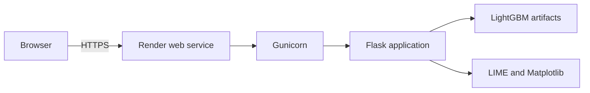

# Production deployment runbook

This runbook describes the recommended container-based release of FetalCare XAI.

## Recommended architecture



**Recommended first host:** Render with Docker.

The application includes native LightGBM libraries, scikit-learn artifacts,
LIME, and Matplotlib. A persistent container process is more predictable than a
Vercel serverless function for this release. Vercel becomes appropriate if a
future frontend is separated from the Python API.

## Release checklist

- [ ] `main` contains the intended release commit
- [ ] GitHub Actions quality checks pass
- [ ] `python -m pytest -q` passes locally
- [ ] `node --check backend/static/app.js` passes
- [ ] No `.env`, patient data, generated graphs, or credentials are tracked
- [ ] Health, prediction, explanation, CSV, print, and comparison flows are tested
- [ ] Research-use and privacy notices remain visible
- [ ] Auto-deploy stays disabled until the first production smoke test succeeds

## Local container verification

```bash
docker build --tag fetalcare-xai:local .
docker run --rm --publish 5000:5000 fetalcare-xai:local
```

Verify:

```bash
curl --fail http://127.0.0.1:5000/health
```

Then open <http://127.0.0.1:5000> and test at least one prediction and LIME
explanation.

<details>
<summary><strong>Expected health response</strong></summary>

```json
{
  "status": "ok",
  "service": "FetalCare XAI",
  "model": {
    "status": "loaded",
    "type": "LGBMClassifier"
  }
}
```

</details>

## Deploy from the Render blueprint

1. Sign in to Render and connect the GitHub repository.
2. Create a new Blueprint and select `render.yaml` from `main`.
3. Review the generated Docker web service.
4. Select a paid Starter instance or larger to reduce model cold-start delays.
5. Keep auto-deploy disabled for the first release.
6. Deploy and wait for `/health` to become healthy.
7. Run the post-deployment checks below.

No database or authentication service is required for this release.

## Environment variables

| Variable | Required | Default | Purpose |
|---|---|---|---|
| `PORT` | Host-provided | `5000` | Gunicorn bind port |
| `FLASK_DEBUG` | No | `false` | Must remain false in production |
| `LOG_LEVEL` | No | `INFO` | Server log verbosity |
| `ALLOWED_ORIGINS` | Only for split frontend | Empty | Comma-separated CORS origins |

Do not add secrets that the application does not need.

## Post-deployment verification

- [ ] The home page loads over HTTPS
- [ ] `/health`, `/schema`, and `/model-card` return HTTP 200
- [ ] Normal, Suspect, and Pathological demos produce their expected classes
- [ ] Random demo values remain within accepted ranges
- [ ] LIME explanation and chart generation complete successfully
- [ ] CSV import remains local to the browser
- [ ] Print / Save PDF renders a complete report
- [ ] Session analytics reset and disappear after refresh
- [ ] Mobile navigation and both themes remain usable
- [ ] Response headers include CSP, frame denial, and content-type protection

## Operational constraints

<details>
<summary><strong>Generated LIME charts</strong></summary>

Charts are transient process-local files. The explanation service only cleans
files created by its own running process and never removes repository assets.
Do not treat generated charts as durable storage.

</details>

<details>
<summary><strong>Scaling</strong></summary>

The Gunicorn configuration uses one worker with multiple threads to limit model
memory duplication. Load-test prediction and explanation latency before raising
worker counts or instance traffic.

</details>

<details>
<summary><strong>Privacy and logging</strong></summary>

Do not add raw CTG measurements, classifications, explanation payloads, or
print-report content to analytics, logs, crash reports, or URLs.

</details>

## Rollback

If a release fails verification:

1. Stop sharing the affected URL.
2. Roll back to the previous healthy Render deployment.
3. Capture server errors without copying CTG payloads.
4. Reproduce locally with synthetic or demo values.
5. Fix through a reviewed branch and passing CI before redeploying.

## Production readiness boundary

Deployment makes the research application publicly accessible; it does not make
it clinically validated. External clinical validation, security review, privacy
assessment, monitoring, and applicable regulatory approval remain necessary
before any clinical use.
