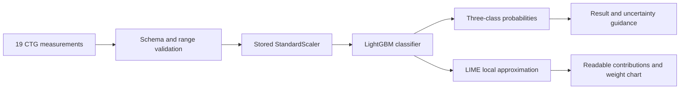

<div align="center">

# FetalCare XAI

### Explainable fetal CTG pattern classification

LightGBM predictions, transparent LIME explanations, and a privacy-conscious
clinical research interface.

[](https://github.com/EganStark/FetalCareXAI_V1.00/actions/workflows/ci-cd.yml)
[](https://www.python.org/)
[](https://flask.palletsprojects.com/)
[](LICENSE)
[](https://creativecommons.org/licenses/by/4.0/)

[Quick start](#quick-start) · [Evaluation](#verified-evaluation) · [API](#api-reference) · [Deployment](DEPLOYMENT.md) · [Contributing](CONTRIBUTING.md)

</div>

> [!IMPORTANT]
> **Research and education only.** FetalCare XAI is not a medical device and
> must not be used for diagnosis, triage, treatment, or patient monitoring.

## Why FetalCare XAI

Cardiotocography produces measurements that can be difficult to interpret
consistently. FetalCare XAI demonstrates how an interpretable machine-learning
workflow can classify CTG feature patterns while showing users what influenced
each individual result.

| Predict | Explain | Explore responsibly |
|---|---|---|
| Probabilities across Normal, Suspect, and Pathological patterns | Plain-language LIME contributions and the original weight chart | No accounts, cloud history, or medical-input analytics |

## Product capabilities

<details open>
<summary><strong>Assessment experience</strong></summary>

- Dark-first responsive interface with an accessible light theme
- Range-aware validation for 19 ordered CTG measurements
- Verified Normal, Suspect, Pathological, and randomized demo inputs
- Real model probabilities with additional low-confidence guidance
- Temporary side-by-side comparison of two assessments

</details>

<details>
<summary><strong>Explainability and reporting</strong></summary>

- Human-readable local feature influence
- Backend-generated LIME weight chart
- Printable report with browser-based PDF export
- CSV template download and validated first-row import
- Versioned model identity and artifact fingerprint

</details>

<details>
<summary><strong>Privacy and production safeguards</strong></summary>

- Session analytics aggregate counts in memory only
- Raw CTG inputs are not saved as history or sent to analytics
- Request-size limits, security headers, safe public errors, and restricted CORS
- Docker, Gunicorn, health checks, and Render blueprint
- Automated Python and JavaScript checks on GitHub Actions

</details>

## How it works



The application keeps prediction and explanation behavior aligned by using the
same ordered feature artifact and stored scaler throughout the pipeline.

## Verified evaluation

The production artifact was evaluated on a reconstructed stratified test split.
The reconstruction removes duplicate rows, uses an 80/20 split with
`random_state=42`, and reproduces the stored accuracy and macro F1 exactly.

| Measure | Held-out result |
|---|---:|
| Test records | 423 |
| Accuracy | **96.69%** |
| Macro F1 | **94.27%** |
| Weighted F1 | **96.55%** |
| ROC AUC, one-vs-rest | **98.99%** |

<details>
<summary><strong>Held-out confusion matrix and class measures</strong></summary>

| Actual \ Predicted | Normal | Suspect | Pathological |
|---|---:|---:|---:|
| Normal | 329 | 1 | 0 |
| Suspect | 11 | 46 | 1 |
| Pathological | 1 | 0 | 34 |

| Class | Precision | Recall | F1 | Support |
|---|---:|---:|---:|---:|
| Normal | 96.48% | 99.70% | 98.06% | 330 |
| Suspect | 97.87% | 79.31% | 87.62% | 58 |
| Pathological | 97.14% | 97.14% | 97.14% | 35 |

The Suspect class has the lowest recall. This limitation matters more than the
overall accuracy and is presented explicitly in the application model card.

</details>

See [EVALUATION_ARTIFACTS.md](EVALUATION_ARTIFACTS.md) for model lineage,
fingerprints, calibration evidence, and unresolved historical discrepancies.

## Dataset provenance

The project uses the **Cardiotocography** dataset: 2,126 fetal CTG records, 21
measured predictors, no missing values, and consensus labels assigned by three
expert obstetricians. The deployed model uses 19 predictors.

> Campos, D. & Bernardes, J. (2000). *Cardiotocography* [Dataset]. UCI Machine
> Learning Repository. <https://doi.org/10.24432/C51S4N>

- [UCI Machine Learning Repository](https://archive.ics.uci.edu/dataset/193/cardiotocography)
- [Kaggle mirror](https://www.kaggle.com/datasets/andrewmvd/fetal-health-classification)
- Dataset license: [Creative Commons Attribution 4.0](https://creativecommons.org/licenses/by/4.0/)

## Technology

| Area | Stack |
|---|---|
| Web service | Python 3.12, Flask, Gunicorn |
| Machine learning | LightGBM, scikit-learn, Joblib |
| Explainability | LIME, Matplotlib |
| Interface | Semantic HTML, modern CSS, vanilla JavaScript |
| Delivery | pytest, GitHub Actions, Docker, Render blueprint |

## Quick start

### 1. Create the environment

<details open>
<summary><strong>Windows with uv</strong></summary>

```powershell
uv python install 3.12.11
uv venv --python 3.12.11 .venv
uv pip install --python .venv\Scripts\python.exe -r requirements.txt
```

</details>

<details>
<summary><strong>macOS or Linux with uv</strong></summary>

```bash
uv python install 3.12.11
uv venv --python 3.12.11 .venv
uv pip install --python .venv/bin/python -r requirements.txt
```

</details>

### 2. Start the application

```bash
python start_app.py
```

Open <http://127.0.0.1:5000>. Confirm service health at
<http://127.0.0.1:5000/health>.

### 3. Run verification

```bash
python -m pytest -q
node --check backend/static/app.js
```

## API reference

| Method | Endpoint | Purpose |
|---|---|---|
| `GET` | `/health` | Service and model health |
| `GET` | `/schema` | Ordered features and accepted ranges |
| `GET` | `/model-card` | Provenance and evaluation evidence |
| `POST` | `/preview` | Validate measurements without inference |
| `POST` | `/predict` | Return classification and probabilities |
| `POST` | `/explain` | Generate a local LIME explanation |

<details>
<summary><strong>Example prediction request</strong></summary>

The complete payload must contain the exact 19 fields returned by `/schema`.

```bash
curl --request POST http://127.0.0.1:5000/predict \
  --header "Content-Type: application/json" \
  --data @measurement.json
```

Example response:

```json
{
  "status": "success",
  "class_id": 1,
  "class_label": "Normal",
  "confidence": 0.999939,
  "probabilities": {
    "Normal": 0.999939,
    "Suspect": 0.000053,
    "Pathological": 0.000008
  }
}
```

</details>

## Repository map

```text
backend/
├── app.py                   API routes and production safeguards
├── model/                   Model artifacts and evaluation evidence
├── services/                Validation, prediction, and LIME services
└── static/                  Responsive application interface
tests/                       Maintained pytest suite
DEPLOYMENT.md                Production deployment runbook
EVALUATION_ARTIFACTS.md      Evaluation and lineage record
Dockerfile                   Reproducible container image
render.yaml                  Render infrastructure blueprint
```

## Documentation

| Guide | Purpose |
|---|---|
| [Deployment runbook](DEPLOYMENT.md) | Build, configure, verify, and release |
| [Evaluation record](EVALUATION_ARTIFACTS.md) | Dataset, split, metrics, and lineage |
| [Contributing](CONTRIBUTING.md) | Engineering and model-change standards |
| [License](LICENSE) | MIT terms for application source |

## Responsible use

> [!WARNING]
> LIME describes local model behavior; it does not establish causality or
> clinical validity. External clinical validation and applicable regulatory
> review are required before any clinical use.

- Never submit or commit identifiable patient information.
- Do not treat model confidence as clinical certainty.
- Do not use this project for emergency or treatment decisions.
- Preserve dataset attribution when redistributing derived work.

## License

Application source code is available under the [MIT License](LICENSE). Dataset
use remains subject to CC BY 4.0 attribution requirements.
